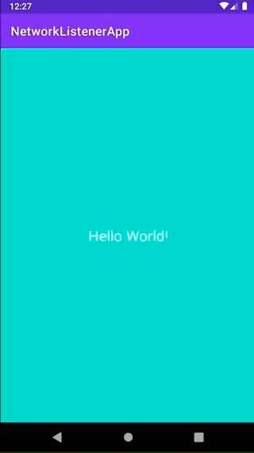

# NetworkListenerApp

## Summary

This sample app provides a working example of setting up a repository that manages listening to changes in the network state of the device and emits the network change via a StateFlow. This flow is then exposed via a ViewModel and can be consumed via any View that cares about changes in network connectivity. 

A walkthrough/explanation can be found with my post on Medium here: 

## Demo

